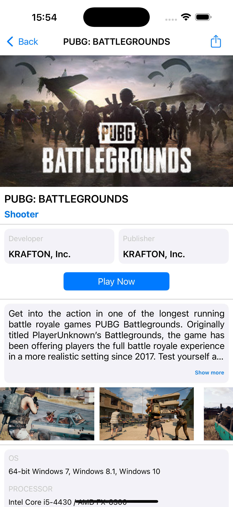
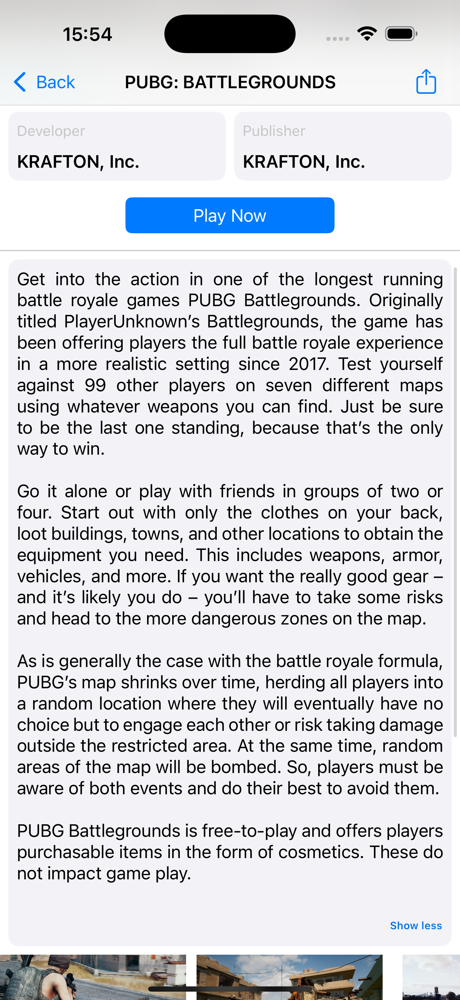
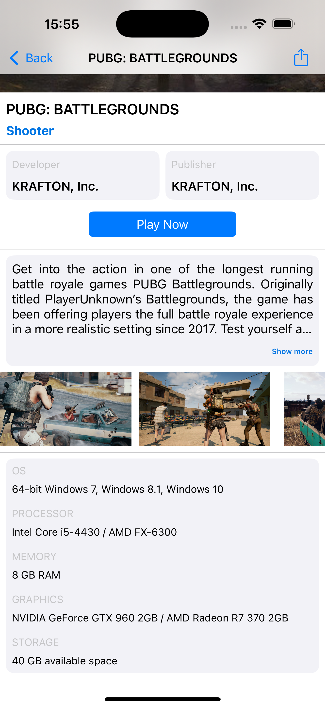
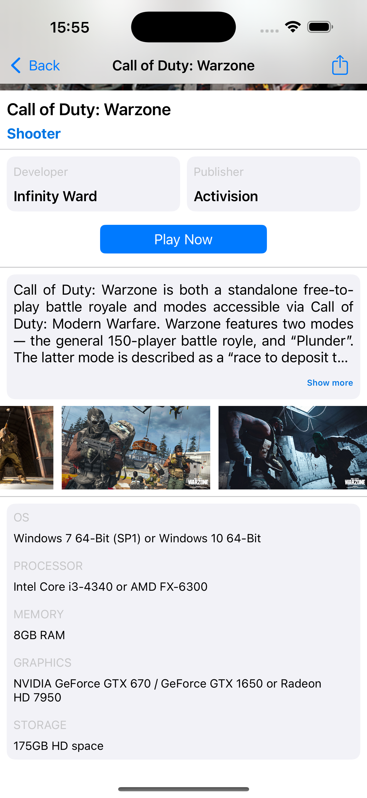
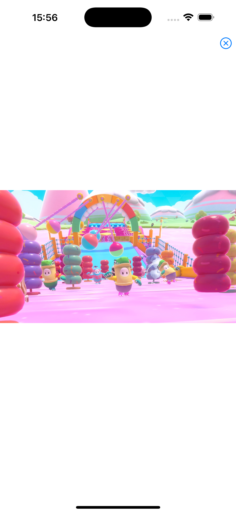
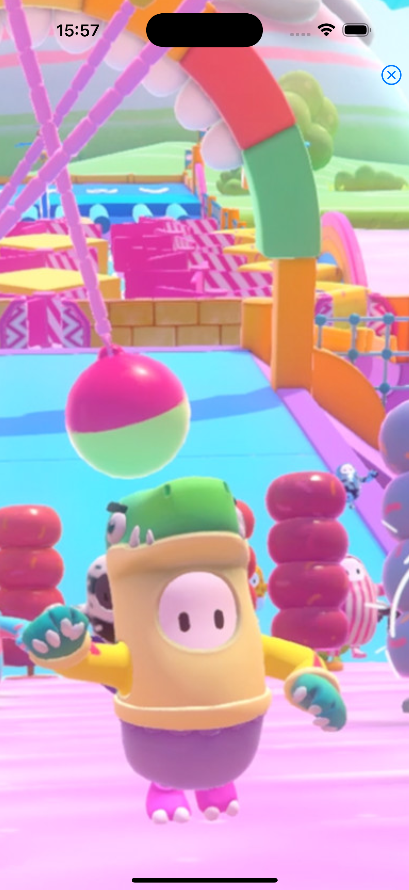

# 🎮 FreeToGame – iOS App

**Descripción:**  
Aplicación nativa de iOS desarrollada en Swift que consume la API de FreeToGame para mostrar un catálogo de juegos gratuitos. Permite ver detalles completos, requisitos del sistema, galería de capturas con zoom, búsqueda en tiempo real, compartir enlaces y abrir juegos en el navegador.

---

## 📌 Funcionalidades

### 🔹 v1.0
- Lista de juegos con **UITableView**
- Consumo de API REST con **async/await**
- Carga asíncrona de imágenes desde URL
- Navegación a pantalla de detalle
- Barra de búsqueda en tiempo real (**UISearchController**)

### 🔹 v1.1
- Pantalla de detalle completa:
  - Thumbnail, título, género, publisher, developer
  - Descripción expandible (Show more / Show less)
  - Esquinas redondeadas en vistas mediante `@IBOutlet collection`
- Botón **Compartir** (envía enlace del juego)
- Botón **Jugar** (abre URL del juego en navegador)

### 🔹 v1.2
- Requisitos mínimos del sistema (OS, procesador, memoria, gráficos, almacenamiento)
- Galería de capturas de pantalla con **UICollectionView**
- Indicadores visuales de plataforma:
  - 🌐 Web Browser
  - 🖥️ PC (Windows)
- Modelo de datos ampliado con `systemRequirements` y `screenshots`

### 🔹 v1.3
- **Zoom interactivo** en capturas de pantalla:
  - Pinch para zoom (1x – 5x)
  - Doble tap para zoom rápido (3x)
  - Desplazamiento cuando la imagen está ampliada
- Botón de cerrar con **efecto de escala**
- **Feedback háptico** (vibración) al abrir y cerrar el zoom
- Efecto visual de toque en las celdas de capturas

---

## 🛠 Tecnologías utilizadas

- **Swift** / **UIKit**
- **async/await** (URLSession)
- **UITableView** + Celda personalizada
- **UICollectionView** + Celda personalizada
- **UISearchController** (búsqueda en tiempo real)
- **UIScrollView** (zoom y desplazamiento)
- **UserDefaults** (favoritos - próximamente)
- **Codable** + **CodingKeys**
- **Auto Layout** (constraints programáticas y Storyboard)
- **Core Haptics** / **UIImpactFeedbackGenerator**

---

## 📷 Capturas de pantalla

### 🟢 v1.0 – Lista y búsqueda
<p align="center">
  
  
</p>

### 🔵 v1.1 – Pantalla de detalle
<p align="center">
  
  
</p>

### 🟣 v1.2 – Requisitos y capturas
<p align="center">
  
  
</p>

### 🔴 v1.3 – Zoom interactivo
<p align="center">
  
  
</p>

---

## 📌 Estado del proyecto

El proyecto ha evolucionado en cuatro versiones principales:

| Versión | Estado | Funcionalidades |
|---------|--------|-----------------|
| v1.0 | ✅ Completado | Lista + API + Búsqueda |
| v1.1 | ✅ Completado | Detalle + Compartir + Jugar |
| v1.2 | ✅ Completado | Requisitos + Screenshots + Plataformas |
| v1.3 | ✅ Completado | Zoom + Vibración + Gestos |
| v2.0 | 🚧 En desarrollo | Favoritos con Core Data / UserDefaults |

---

## 📝 Lo que aprendí

- Consumo de API REST con `async/await`
- Manejo de `UITableView` y `UICollectionView` con celdas personalizadas
- Navegación entre pantallas con **NavigationController** y segues
- Implementación de **UISearchController** para búsqueda en tiempo real
- Zoom y desplazamiento con `UIScrollView` + `UIScrollViewDelegate`
- Creación de transiciones personalizadas y efectos visuales
- Feedback háptico con `UIImpactFeedbackGenerator`
- Manejo de imágenes asíncronas y caché automática
- Uso de **CodingKeys** para mapear JSON con nombres distintos
- Organización de código en múltiples archivos (MVC)

---

## 🚀 Cómo ejecutar

1. Clona el repositorio:

```bash
git clone https://github.com/GualpaJ/FreeToGame-iOS.git
